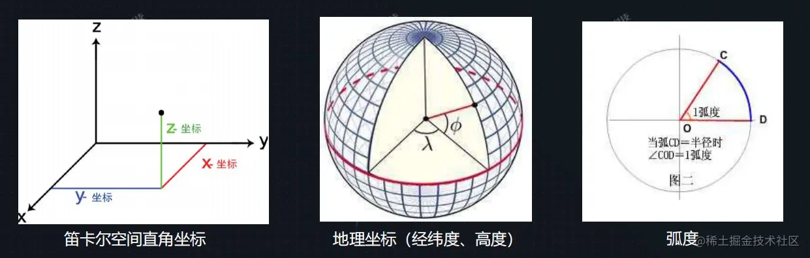

# [坐标系及转换](https://juejin.cn/post/7057776364010602526)

## 常用坐标系

- 屏幕坐标（像素值）
- 笛卡尔平面坐标 new Cesium.Cartesian2(x, y)
- 笛卡尔空间直角坐标 new Cesium.Cartesian3(x, y, z)
- 地理坐标（默认为弧度值）new Cesium.Cartographic(longitude, latitude, heigh)



## 坐标变换

- 获取鼠标单击后在屏幕中的坐标

```javascript
let hander = new Cesium.ScreenSpaceEventHandler(viewer.scene.canvas);
// 绑定鼠标左点击事件
hander.setlnputAction(function (event){
    let windowPosition = event.position; // 获取鼠标点的 windowPosition 
}, Cesium.ScreenSpaceEventType.LEFT CLICK);
```

- 屏幕坐标 转换为 笛卡尔空间直角坐标

```javascript
// 三维模式下
let ray = viewer.camera.getPickRay(windowPosition);
let cartesian = viewer.scene.globe.pick(ray, viewer.scene);

// 二维模式下
let cartesian = scene.camera.pickEllipsoid(position, scene.globe.ellipsoid);
```

- 笛卡尔空间直角坐标 转换为 屏幕坐标

```javascript
let pick = Cesium.SceneTransforms.wgs84ToWindowCoordinates(viewer.scene, cartesian);
```

- 地理坐标（弧度制） 转换为 笛卡尔空间直角坐标

```javascript
let position = Cesium.Cartesian3.fromRadians(Ing, lat, height);
```

- 笛卡尔空间直角坐标 转换为 地理坐标（经纬度）

```javascript
let cartographic = Cesium.Cartographic.fromCartesian(cartesian);
let lat = Cesium.Math.toDegrees(cartographic.latitude);
let Ing = Cesium.Math.toDegrees(cartographic.longitude);
let height = cartographic.height;
```

- 度数与弧度互转

```javascript
Cesium.Math.toDegrees(radians); // 弧度 转 度数
Cesium.Math.toRadians(degrees); // 度数 转 弧度
```

- 地理坐标（经纬度）转换为 笛卡尔空间直角坐标

```javascript
let position=Cesium.Cartesian3.fromDegrees(longitude, latitude, height);
```
